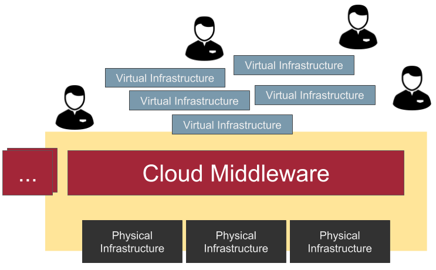
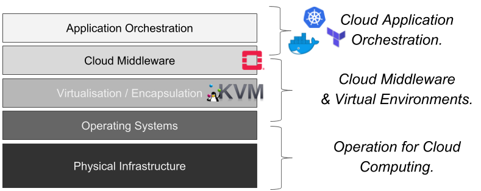

# About this Course

## Overview

In this practical hands-on you will learn how to work with Cloud computing from Infrastructure as a Service towards Platform as a Service.

{height=40%}

## Prerequisits

 * You should be familiar with Linux and Bash, and have a basic understanding of networking with Linux
 * The course assumes that you have access to an OpenStack cloud.

## Before we take off ...

The overall course consists of a set of *exercises* (see overview below). Each Exercise contains at least one *lesson*, which itself has steps like *Task* (practical hands-on), *Research* (look up information), or *Question* (validate yourself). Exercises build on top of each other - meaning, to make use of these exercises, stay on track. Let's go!

## Before we take off ... (2)

 * The exercises are available as PDFs or as Markdown at Github:
[https://github.com/cha87de/clouds-exercises](https://github.com/cha87de/clouds-exercises)

 * The `README.md` is the Markdown entrypoint for each exercise. The suggested solution is located in `solution.md`.

## Exercises Overview

 * Exercise 1: OpenStack basics
 * Exercise 2: Monitoring and Vertical Scaling
 * Exercise 3: Horizontal scaling and load balancing
 * Exercise 4: Automating Cloud Deployments
 * Exercise 5: Container Basics
 * Exercise 6: Container Orchestration

## Orientation & Exercise Topics

The Exercises walk from "Cloud Middleware" up towards Containers and Platform as a Service.

{height=70%}

## Comments, Questions, Anything?

... if not, let's get started with exercise 1! :-)

Direct further questions to [christopher.hauser@uni-ulm.de](mailto:christopher.hauser@uni-ulm.de)