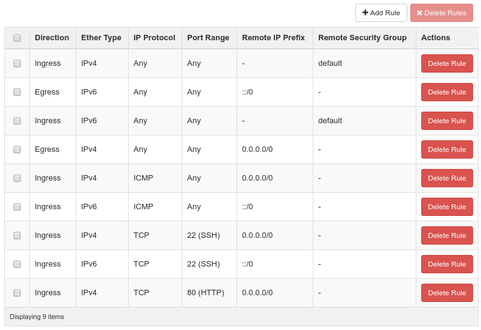

# Lesson 2: First Steps with Omistack

In this lesson, we will register an account for the OpenStack installation at
our Institute - called Omistack. **Registration may take a few days** - so
please register in time, in order to proceed with all remaining tasks, lesson 3
and all the following exercises.

## Task: Register at Omistack

In the lecture's moodle course you'll find a post in the forum, titled "Register
at Omistack". Please leave a short note there, to inform us, that you need an
account.

Please resume to the **next task only, when you have access to Omistack** - or
any similar OpenStack. When you have access, make yourself familiar with the
OpenStack dashboard, located at https://omistack.e-technik.uni-ulm.de

Please note: bwCloud - the University's OpenStack - is due to resource
shortcomings not capable of hosting us this semester.

## Task: Create an SSH key

In OpenStack, Instances (Virtual Machines, usually Linux servers) are managed
via a SSH connection from your pc. For security reasons, authentication is not
with a password but with keys (cf. lesson 1).

You can create an SSH key within the OpenStack dashboard. Select "Key Pairs" in
the menu. Then press "Create Key Pair". Choose "cloud_key" as "Key Pair Name",
and press the "Create Key Pair" button.

OpenStack will start downloading the private key as a file after it has created
the Key Pair. It is *important that you save and keep this file*, as you will
need it later on and there is no actual way make OpenStack deliver it again.
Backup this private key! If you loose your private key, you won't be able to
access Instances (Virtual Machines) any more!

Alternatively, you can upload an SSH key, which you generated already on your
pc, e.g. using the [ssh-keygen tool](https://linux.die.net/man/1/ssh-keygen).

## Task: Adapt Security Rules

Before we can work with OpenStack, we need to check the firewall rules to allow
remote access. These firewall rules are organised within "security groups". In
the OpenStack dashboard, go to "Network" and "Security Groups". You should see
only the "default" security group. Click on "manage rules". The rules should be
similar to the following ones:

## Task: Validate your Network

Before starting your first Instance, a basic virtual network is required, if you
want to access and hence use your new instance.

In the OpenStack dashboard, click the "Network" item in the menu, then select
"Routers". You should see one router here. Then click "Network" item and then
select "Networks". You should see one private network with an IP Subnet
192.168.0.0/24 here.

Virtual Networks will be studied in more detail in exercise 3. If you miss the
router or the private network, please contact us via the Moodle forum.

## Task: Launch your first Instance

Virtual machines in OpenStack are called "Instances". Let's start your first
one, by launching an Ubuntu Server.

In the Details tab:

 - Select "Instances" on the left column and then click the "Launch Instance" button.
 - Select "nova" as availability zone
 - Name your instance e.g. "main_server"

In the Source tab:

 - Select Boot Source: Image
 - Create New Volume: No
 - Select in the list "Ubuntu Server 14.04.2 AMD64 LTS" with the arrow button

In the Flavor tab:

 - Select "small" as flavor (2 cores, 1GB memory, 10GB disk)

In the Networks tab:

 - Select your private network

In the Security Groups tab:

 - Select the "default" security group

In the Key Pair tab:

 - select the key you previously created (cloud_key)

Finally, launch the virtual machine, by clicking the "Launch Instance" button. This may take from some seconds to a few minutes. The new instance gets a private IP
address 192.168.0.X assigned automatically.

To access the instance from remote, add a so called "Floating IP":

 - while the instance is spawning, press the "Associate Floating IP" button, after it was spawned, find this option in the drop down menu next to the "create snapshot" button.
 - If you see "No floating IP addresses allocated", then press the "plus" button to allocate a floating IP in the extnet pool.
 - Select the new floating IP and press the "Associate" button.

Your instance has now two IP addresses: the private one from before, and a public one 134.60.64.Y. You need this public one to access your instance via SSH.

## Task: Access your Instance via SSH

It is time to access your new instance via SSH with your favourite SSH client.
Make sure you have your SSH key file at hand. To access your instance, you need the
public IP address from your instance. This IP address is listed in the
OpenStack dashboard, where you launched it.

The **SSH username** for the ubuntu image is **ubuntu**, a password is not set
since we use key based authentication.

Some more hints to access via SSH:

*Windows* For Windows users, we suggest using [putty in combination with
    puttygen](http://www.chiark.greenend.org.uk/~sgtatham/putty/download.html).
    An instruction on how to make use of the OpenStack key with putty is
    available
    [here](https://github.com/naturalis/openstack-docs/wiki/Howto:-Creating-and-using-OpenStack-SSH-keypairs-on-Windows)
    in the sections "Converting a Key" and "Using the key with putty".

*Linux / Mac* In Linux or Mac, an SSH client is shipped with almost all
    distributions. Using a key can be enforced by applying the -i command line
    parameter (for details type "man ssh" in a terminal).

If you're asked "Are you sure you want to continue connecting (yes/no)?" you can accept with typing "yes" and pressing enter.