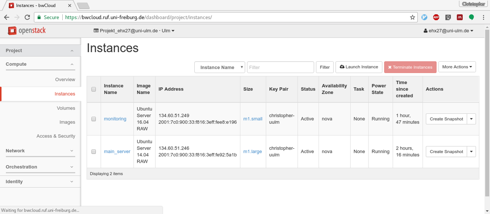
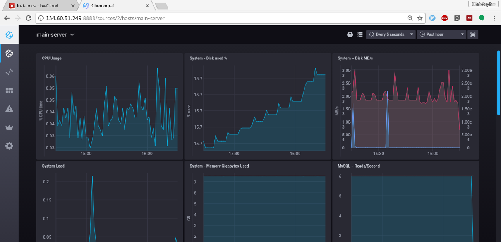
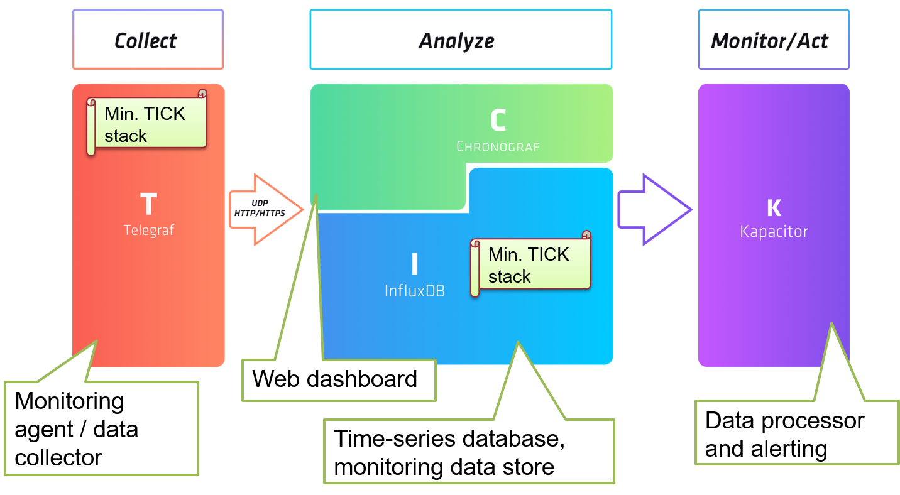
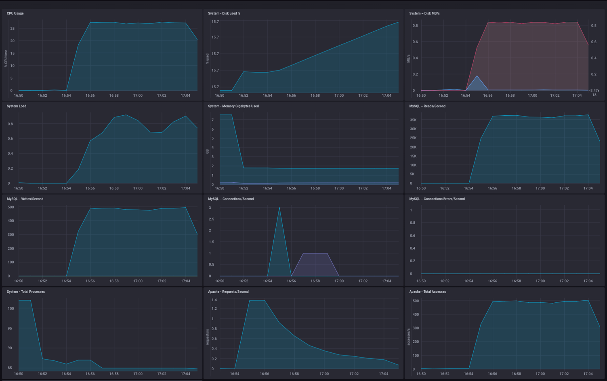
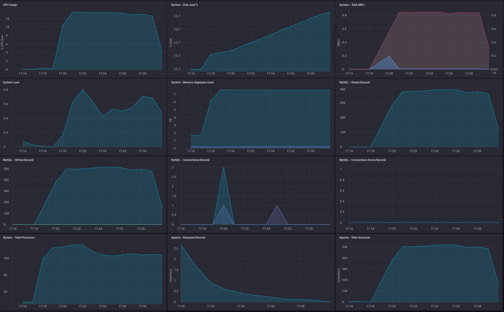
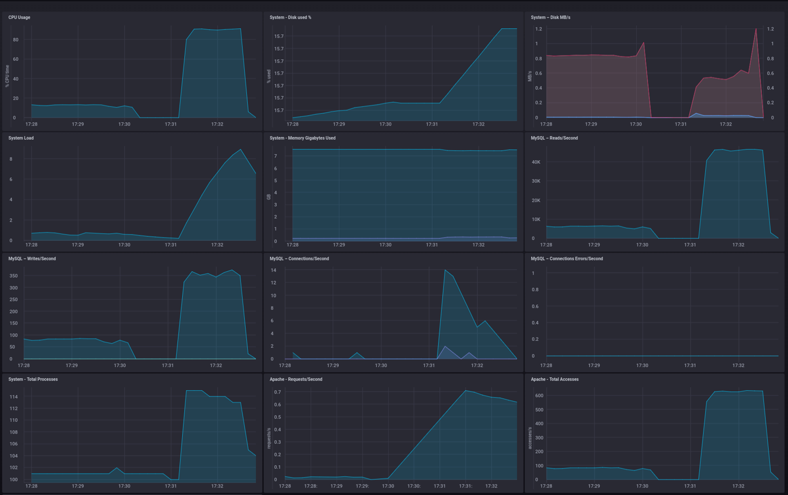

# Lesson 1: Monitoring with InfluxData

## How your Setup should look like

You should have two instances in Openstack:



The Chronograf dashboard for your main-server instance should look like follows:




## Question: Parts and responsibilities of the TICK stack



## Question: What ports are used by influxdb?
By default, InfluxDB uses the following network ports:
 - TCP port 8086 is used for client-server communication over InfluxDB’s HTTP API
 - TCP port 8088 is used for the RPC service for backup and restore

```
ubuntu@monitoring:~$ sudo netstat -tulpen
sudo: unable to resolve host monitoring
Active Internet connections (only servers)
Proto Recv-Q Send-Q Local Address           Foreign Address         State       User       Inode       PID/Program name
tcp        0      0 0.0.0.0:22              0.0.0.0:*               LISTEN      0          13017       1043/sshd       
tcp6       0      0 :::8086                 :::*                    LISTEN      999        18068       2411/influxd    
tcp6       0      0 :::22                   :::*                    LISTEN      0          13025       1043/sshd       
tcp6       0      0 :::8888                 :::*                    LISTEN      998        18308       2505/chronograf 
tcp6       0      0 :::8088                 :::*                    LISTEN      999        18066       2411/influxd    
udp        0      0 0.0.0.0:68              0.0.0.0:*                           0          13398       880/dhclient 
```

# Lesson 2: Vertical Scaling

## Stressing Mediawiki with small flavor

With a single thread on client side:

```
Concurrency Level:      1               <<<<
Time taken for tests:   618.219 seconds
Complete requests:      5000
Failed requests:        4958
   (Connect: 0, Receive: 0, Length: 4958, Exceptions: 0)
Non-2xx responses:      5000
Total transferred:      58650042 bytes
HTML transferred:       56685042 bytes
Requests per second:    8.09 [#/sec] (mean)
Time per request:       123.644 [ms] (mean)
Time per request:       123.644 [ms] (mean, across all concurrent requests)
Transfer rate:          92.65 [Kbytes/sec] received

Connection Times (ms)
              min  mean[+/-sd] median   max
Connect:        0    0   0.8      0      12
Processing:   101  123  21.5    121    1124
Waiting:       55   71  14.2     68     813
Total:        101  124  21.5    121    1124

Percentage of the requests served within a certain time (ms)
  50%    121
  66%    125
  75%    127
  80%    129
  90%    135
  95%    142
  98%    152
  99%    162
 100%   1124 (longest request)
```



With ten concurrent client side threads:

```
Concurrency Level:      10              <<<<
Time taken for tests:   165.952 seconds
Complete requests:      5000
Failed requests:        4
   (Connect: 0, Receive: 0, Length: 4, Exceptions: 0)
Non-2xx responses:      5000
Total transferred:      58654996 bytes
HTML transferred:       56689996 bytes
Requests per second:    30.13 [#/sec] (mean)
Time per request:       331.903 [ms] (mean)
Time per request:       33.190 [ms] (mean, across all concurrent requests)
Transfer rate:          345.16 [Kbytes/sec] received

Connection Times (ms)
              min  mean[+/-sd] median   max
Connect:        0    0   0.5      0      11
Processing:    89  332  57.8    333     501
Waiting:       76  284  50.9    285     442
Total:         90  332  57.8    333     501

Percentage of the requests served within a certain time (ms)
  50%    333
  66%    357
  75%    372
  80%    380
  90%    406
  95%    425
  98%    447
  99%    459
 100%    501 (longest request)
```


## Stressing Mediawiki after vertical scaling

With a single thread on client side:

```
Concurrency Level:      1
Time taken for tests:   604.299 seconds
Complete requests:      5000
Failed requests:        4904
   (Connect: 0, Receive: 0, Length: 4904, Exceptions: 0)
Non-2xx responses:      5000
Total transferred:      58650096 bytes
HTML transferred:       56685096 bytes
Requests per second:    8.27 [#/sec] (mean)
Time per request:       120.860 [ms] (mean)
Time per request:       120.860 [ms] (mean, across all concurrent requests)
Transfer rate:          94.78 [Kbytes/sec] received

Connection Times (ms)
              min  mean[+/-sd] median   max
Connect:        0    0   0.1      0       2
Processing:   101  121  20.6    117     915
Waiting:       53   69  19.6     65     801
Total:        101  121  20.6    117     916

Percentage of the requests served within a certain time (ms)
  50%    117
  66%    121
  75%    124
  80%    126
  90%    132
  95%    140
  98%    159
  99%    177
 100%    916 (longest request)
```



With ten concurrent client side threads:

```
Concurrency Level:      10
Time taken for tests:   79.773 seconds
Complete requests:      5000
Failed requests:        1324
   (Connect: 0, Receive: 0, Length: 1324, Exceptions: 0)
Non-2xx responses:      5000
Total transferred:      58653676 bytes
HTML transferred:       56688676 bytes
Requests per second:    62.68 [#/sec] (mean)
Time per request:       159.547 [ms] (mean)
Time per request:       15.955 [ms] (mean, across all concurrent requests)
Transfer rate:          718.02 [Kbytes/sec] received

Connection Times (ms)
              min  mean[+/-sd] median   max
Connect:        0    0   0.1      0       2
Processing:    61  159  36.8    156     313
Waiting:       53  134  28.8    132     272
Total:         61  159  36.8    156     314

Percentage of the requests served within a certain time (ms)
  50%    156
  66%    171
  75%    182
  80%    190
  90%    209
  95%    225
  98%    243
  99%    258
 100%    314 (longest request)
```



## Conclusion

| CPU cores | Threads | Requests / s |
| --- | --- | --- |
| 2 | 1 | 8 Req/s |
| 2 | 10 | 30 Req/s |
| 4 | 1 | 8 Req/s |
| 4 | 10 | 60 Req/s |

 - Application is CPU bound
 - For concurrent requests more vCPUs are improving a lot!
 - Virtual scaling is limited to the larges available flavor.
 - => unlimited scalability is not vertical.
