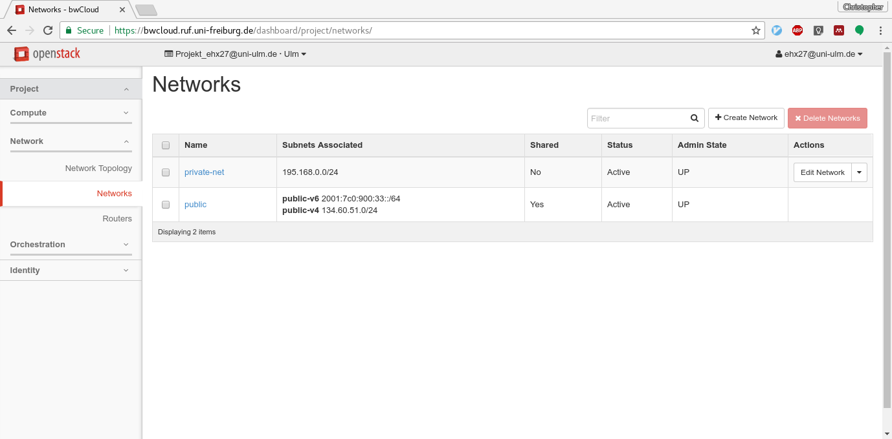
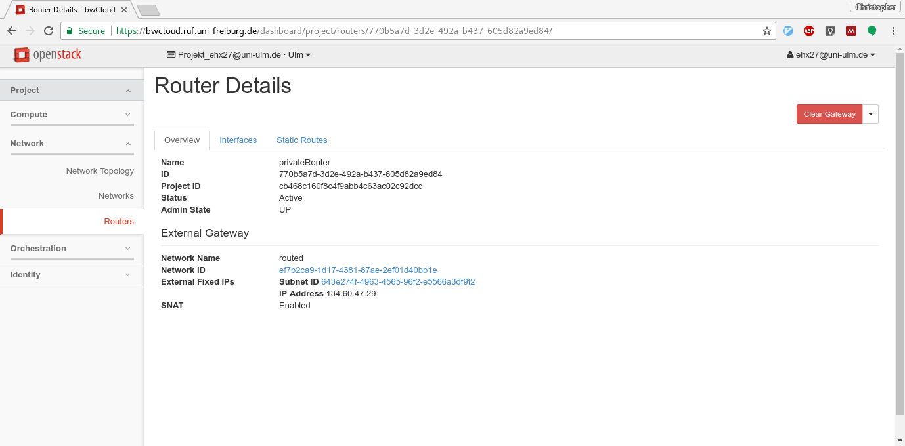
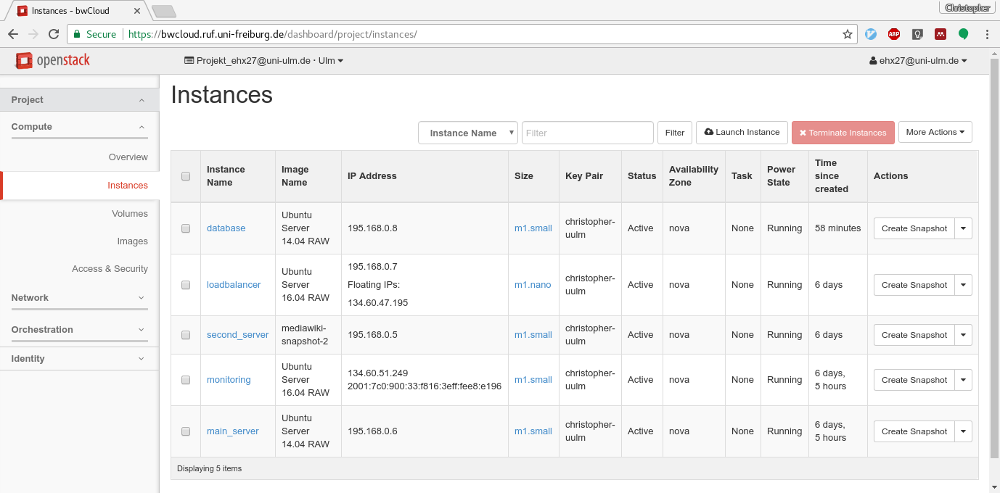

# Answers to questions

## Lesson 1: Extend your knowledge about OpenStack

### Question: OpenStack Projects
1. *How is the project called, which provides virtual machines in OpenStack?*

    The project for virtual machines is the compute service, named Nova. 
    Before schedules virtual machine requests to servers in a data centre. The Nova project requires at least Keystone (identity service) for user handling and Glance (image service) to start a vm from images and store snapshots.

2. *What are the main differences between Object Store (Swift) and Block Storage (Cinder)?*

    Swift provides a REST interface to applications, which can store any kind of data as a BLOB. The stored object is accessible with a unique identifier.
    Cinder provides volumes, which are attached to virtual machines as virtual disks via iSCSI. While Swift is used by applications, Cinder is used by operating systems to e.g. place a filesystem on top of a virtual block device.

### Question: Floating IPs vs. DHCP

*What are the benefits and drawbacks of the manual assignment of floating IPs to virtual machines, compared to the automatic assignment in DHCP?*

The manual assignment of floating IPs to virtual machines allows the user to reuse a floating IP but move it to a different virtual machine. The public IP of a vm is under the user's control, and not randomly assigned by a DHCP service.

One example: Imagine, the mediawiki instance from exercise 1 would have had a floating ip assigned, and the setup has to be extended by a load balancer. The existing floating ip could have been moved from the mediawiki vm to the load balancer vm - the user of your mediawiki would not have even noticed the change.


## Lesson 2: Multi-tier applications in Cloud Computing

### Question: Multi-tier applications

1. *Which tiers are typically used in a web-based application?*

    The actual usage and implementation of tiers depends on the application. 
    But in principal:
    - The presentation tier is usually split between a browser and a server side component which renders html code. The html rendering is often named frontend tier.
    - The logic tier contains the application software and can be java, php, python, ... The communication between the frontend and the logic tier can be REST or any other protocol.
    - The data tier is mostly a database server, or a file system.

2. *How many tiers has the mediawiki application?*

    Sometimes the logic tier and the frontend tier are closely connected with each other. The mediawiki application hence has a frontend tier, which is part of / triggered by the logic tier. Finally the data tier is the database server.

    Mediawiki defines another network tier, which is the part between the browser and the server side component in the presentation tier in the previous definition.

3. *Why is it useful to deploy each tier to a separate vm in cloud computing? Or why is it not useful?*

    Having each tier in one vm separates the resource requirements: a frontend service may require a different ratio of CPU cores, memory and disk than a database service. Further, the services don't interfere with each other and don't compete by the resources (e.g. CPU time). Separating from the beginning finally allows horizontal scaling.

    Separating tiers in vms is hence useful for medium to large applications with a reasonable load. For small or less loaded applications the overhead by splitting the tiers may reduce the performance (e.g. by additional networking).

## Lesson 3: Horizontal Scaling and Load Balancing

### Question: Stressing the horizontally scaled mediawiki

- *How much requests per second have you achieved with the vertically scaled mediawiki setup?*

    Please see below in the practical part.


- *How much requests per second do you achieve now with the horizontally scaled mediawiki setup?*

    Please see below in the practical part.

- *Vertical scaling was quite limited to the maximum flavor size. Can you image the new bottleneck of horizontal scaling?*

    Since we scaled the mediawiki application, the new bottleneck will eventually be the database server. Generally, scaling one tier requires eventually to scale other connected tiers.

    At some point the load balancer might be the bottleneck. A proper solution will then be somewhere in the networking (e.g. DNS round robin, geo-based IP routing, ...)


# Solution for practical part

You should have a private network and a private router.





You should have five VMs now:

 - The **monitoring vm** is still attached directly to the public network, unchanged from exercise 2. This vm contains Influxdb to store and Chronograf to display monitoring data.
 - The **main_server vm** is now attached to the private network and has no public ip, since it is "behind the load balancer". This vm contains one mediawiki instance as a php application in an apache2 webserver.
 - The **second_server vm** is a copy of the main_server vm.
 - The **loadbalancer vm** is attached to the private network and has a public floating ip. An nginx server is running as load balancer and redirects user requests to one of main_server or second_server. This vm is used to tunnel via ssh to the vms without public IPs.
 - The **database vm** is attached to the private network only, which provides additional security to your data. The vm contains the mariadb database, used as data tier for your mediawiki setup.



## Stressing the application

Both mediawiki instances are running on flavor m1.small with 2 cpu cores.
Besides the two mediawiki vms, a load balancer vm and a database vm exist.

Reminder of vertical scaling results:

| vCPUs | concurrency | R/s |
| --- | --- | --- |
| 2 | 1 | 8 R/s | 
| 2 | 10 | 30 R/s | 
| 4 | 1 | 8 R/s | 
| 4 | 10 | 60 R/s | 

Horizontal scaling (2 instances) results:

| vCPUs | concurrency | R/s |
| --- | --- | --- |
| 2 | 1 | 6 R/s | 
| 2 | 10 | 53 R/s | 

It is visible, that the extraction of the database reduced the rate from 8 to 6 requests/s.
Yet the horizontally scaled system can handle more parallel requests, and can be further scaled out to three instances if needed.

The full traces are shown below:

```
ab -n 5000 http://134.60.47.195/wiki/index.php/Main_Page
This is ApacheBench, Version 2.3 <$Revision: 1706008 $>
Copyright 1996 Adam Twiss, Zeus Technology Ltd, http://www.zeustech.net/
Licensed to The Apache Software Foundation, http://www.apache.org/

Benchmarking 134.60.47.195 (be patient)
Completed 500 requests
Completed 1000 requests
Completed 1500 requests
Completed 2000 requests
Completed 2500 requests
Completed 3000 requests
Completed 3500 requests
Completed 4000 requests
Completed 4500 requests
Completed 5000 requests
Finished 5000 requests


Server Software:        nginx/1.10.3
Server Hostname:        134.60.47.195
Server Port:            80

Document Path:          /wiki/index.php/Main_Page
Document Length:        13549 bytes

Concurrency Level:      1
Time taken for tests:   843.084 seconds
Complete requests:      5000
Failed requests:        4883
   (Connect: 0, Receive: 0, Length: 4883, Exceptions: 0)
Total transferred:      69855117 bytes
HTML transferred:       67740117 bytes
Requests per second:    5.93 [#/sec] (mean)
Time per request:       168.617 [ms] (mean)
Time per request:       168.617 [ms] (mean, across all concurrent requests)
Transfer rate:          80.91 [Kbytes/sec] received

Connection Times (ms)
              min  mean[+/-sd] median   max
Connect:        0    0   0.3      0      11
Processing:   150  168   9.9    166     284
Waiting:       73   89   9.2     87     184
Total:        150  169   9.9    167     285

Percentage of the requests served within a certain time (ms)
  50%    167
  66%    170
  75%    172
  80%    174
  90%    179
  95%    184
  98%    198
  99%    209
 100%    285 (longest request)
```

```
ab -c 10 -n 5000 http://134.60.47.195/wiki/index.php/Main_Page
This is ApacheBench, Version 2.3 <$Revision: 1706008 $>
Copyright 1996 Adam Twiss, Zeus Technology Ltd, http://www.zeustech.net/
Licensed to The Apache Software Foundation, http://www.apache.org/

Benchmarking 134.60.47.195 (be patient)
Completed 500 requests
Completed 1000 requests
Completed 1500 requests
Completed 2000 requests
Completed 2500 requests
Completed 3000 requests
Completed 3500 requests
Completed 4000 requests
Completed 4500 requests
Completed 5000 requests
Finished 5000 requests


Server Software:        nginx/1.10.3
Server Hostname:        134.60.47.195
Server Port:            80

Document Path:          /wiki/index.php/Main_Page
Document Length:        13549 bytes

Concurrency Level:      10
Time taken for tests:   94.127 seconds
Complete requests:      5000
Failed requests:        920
   (Connect: 0, Receive: 0, Length: 920, Exceptions: 0)
Total transferred:      69859080 bytes
HTML transferred:       67744080 bytes
Requests per second:    53.12 [#/sec] (mean)
Time per request:       188.254 [ms] (mean)
Time per request:       18.825 [ms] (mean, across all concurrent requests)
Transfer rate:          724.78 [Kbytes/sec] received

Connection Times (ms)
              min  mean[+/-sd] median   max
Connect:        0    0   0.3      0      13
Processing:    75  188  52.2    183     495
Waiting:       63  156  40.5    152     425
Total:         75  188  52.2    184     495

Percentage of the requests served within a certain time (ms)
  50%    184
  66%    207
  75%    222
  80%    232
  90%    258
  95%    278
  98%    306
  99%    321
 100%    495 (longest request)
```
