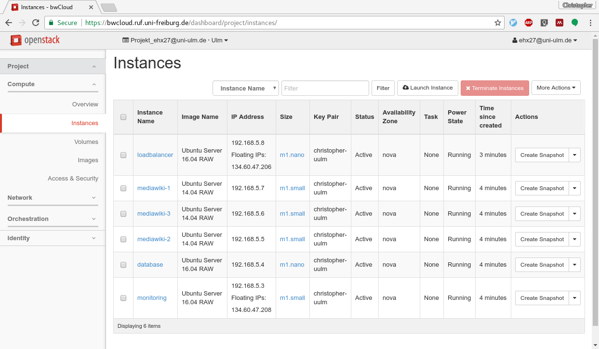
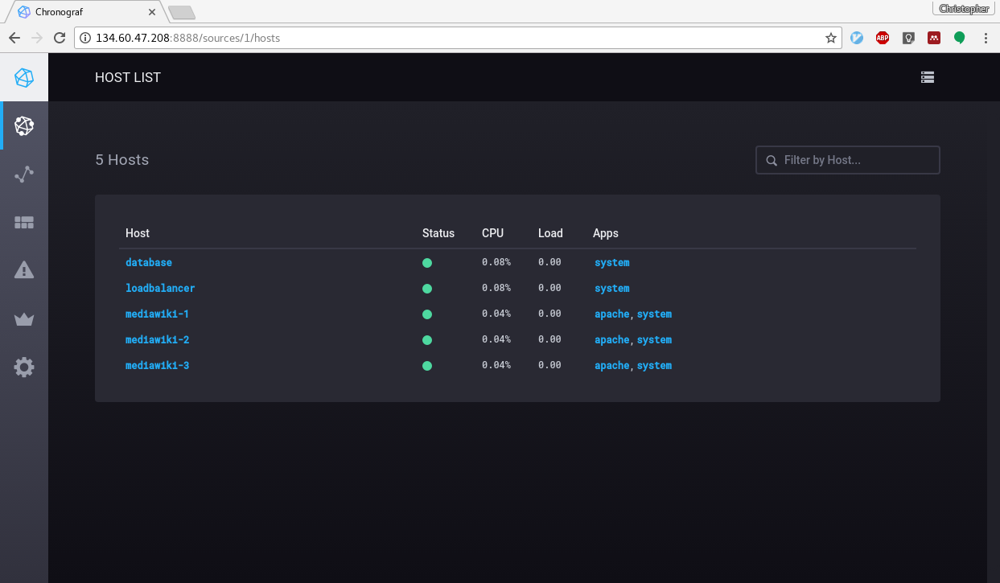

# Answers to questions

## Lesson 1: Concept of Cloud Computing

### Question: Essential Characteristics

*What are the essential characteristics according to the NIST Definition of Cloud Computing?*

  - On-demand self-service. 
  - Broad network access.
  - Resource pooling.
  - Rapid elasticity. 
  - Measured service.

*What characteristics and features are needed in order to provide "rapid elasticity"?*

  The elasticity needs support from the cloud platform and from the application. 
  The cloud platform must provide new resources on demand and very quick whenever they are needed. 
  Ideally the new resources can be created automatically, which requires some kind of API to the cloud platform.
  On the other hand, the application has to be scalable. One large monolithic application (e.g. in one large vm) 
  will never make us of the elasticity, since it is hardly horizontally scalable.

*What is the difference between scalability and elasticity?*
        
  (Horizontal) scalability is one important enabler for elasticity, but not the only one. 
  Scalability means to add more resources to the application. While elasticity means, to add
  and remove the application's resources on demand. One example: add or remove more 
  mediawiki vms automatically, depending on the actual requests per second measured on the loadbalancer.

### Question: Pet vs. Cattle

* What is the definition of "Pet" servers, what of "Cattle" servers?
  
  - Pet: manually built, managed and "hand fed". Indispensable system, never can be down.
  - Cattle: Arrays of servers, automated deployments. Servers can fail and will be replaced.

* What are the benefits / drawbacks of "Cattle"?

  - Drawback: Automation requires addition effort
  - Benefit: Cattle allow on the fly horizontal scaling, and deployments to make use of Cloud computing

* How are the essential characteristics of Cloud Computing enabling "Cattles"?

  The automated deployments of Cattle servers, and the awareness of application
  state make use of the essential characteristics like rapid elasticity and
  on-demand self-service. The other way round, Cattle needs a system for
  resource pooling, to allocate new virtual servers within short time. 
  
*Without the concept of cattle, the essential characteristics of cloud computing may not be fully used. A simple virtualisation system may be sufficient for pets.*

### Question: Infrastructure and Application Deployment

*What are the three stages a Terraform script walks through?*

  1. *Write* infrastructure as code
  2. *Plan* changes before applying
  3. *Create* or reproduce infrastructure

*Which cloud platforms are supported by Terraform?*

  Many of the popular cloud platforms are supported, like OpenStack, Amazon EC2, Microsoft Azure, ...

  But: as you saw in the practical part, the resource identifiers are bound to a specific platform. 
  If you want to start a virtual machine `openstack_compute_instance_v2` in amazon, a lot of changes have to happen.
  Terraform has solutions for this limitation, which was not discussed in this exercise.


*How can cloud-init be used to deploy an application inside a virtual machine?*

  With cloud-init a cloud platform user can provide two types of user data, which are passed through into the virtual machine:
  either a descriptive yaml file or a (bash) script. We can use the bash script to deploy an application inside a virtual machine.


## Lesson 2: Concept of Cloud Computing

### Questions: Terraform and cloud-init

*Where can you watch and validate the execution of a cloud-init script?*

  Since cloud-init is triggered directly after the operating system in the virtual machine has completed, the output is visible
  in the openstack dashboard. Navigate to the "log" tab in the details view of a virtual machine.

*How does Terraform help you with scaling elastically?*

  Terraform allows to script the infrastructure and automatically deploy the application via cloud-init.
  Scaling is hence a matter of adapting the Terraform script, and applying it again via `terraform apply`.

*Can you imagine how to automatically scale your setup when the load increases/decreases?*
        
  Terraform is driven by manual user interaction by default. If an automated scale-in or scale-out should 
  happen, Terraform scripts and the apply command should be somehow integrated into a monitoring chain. 
  Remember, there was the `Kapacitor` as part of the InfluxData TICK stack, which could trigger such a terraform interaction.

  But basically terraform is not meant to run as a service or supervise workloads. 
  We will learn new tools in a few exercises, which can scale automatically.

*Terraform destroys resources and rebuilds them on changes. E.g. for our Database, where is the right place to store the application state?*

  Working with "Cattle" servers and automated deployments means, that
  application state is handled like but separated from compute resources. State
  can be handled by the application itself (e.g. using an Object Store like
  Swift or Amazon S3) or by using Block Devices (e.g. via OpenStack Cinder).
  Terraform can create and attach Cinder volumes to instances, to persist the
  application state independently of the instance itself.

# Solution for practical part

You should have six virtual machines in bwcloud after your changes to the Terraform and cloud-init scripts (cf. image below).



We will now go through the changes you should have done in detail.

## Add two more mediawiki instances

Changes to instances.tf are required. Copy the following code block and paste it twice:

```
# create first mediawiki instance
resource "openstack_compute_instance_v2" "mediawiki-1" {
	name = "mediawiki-1"
	image_name = "..."
	flavor_name = "..."
	key_pair = "..."
	security_groups = ["default"]
	region	= "..."
	network {
		uuid = "${openstack_networking_network_v2.private-net.id}"
	}
	user_data = "${data.template_file.init_mediawiki.rendered}"
}
```

Make sure to change the two occurences of `mediawiki-1` appropriately.

### Add monitoring vm

Add another `openstack_compute_instance_v2` resource to the instance.tf file, don't forget the monitoring security group (was already part of the security_groups.tf file):

```
resource "openstack_compute_instance_v2" "monitoring" {
	name = "monitoring"
	image_name = "..."
	flavor_name = ..."
	key_pair = "..."
	security_groups = ["default", "monitoring"]
	region	= "..."
	network {
		uuid = "${openstack_networking_network_v2.private-net.id}"
	}
	user_data = "${data.template_file.init_monitoring.rendered}"
}
```

To install Influxdb and Chronograf, you need to create another `template_file` element and reference it accordingly in the `user_data` field of the new resource:

```
data "template_file" "init_monitoring" {
    template = "${file("init_monitoring")}"
}
```

The referenced bash script, which will be passed through into the virtual machine via cloud-init, has to be created. It could look like the following:

```
#!/bin/bash
sudo -s

curl -sL https://repos.influxdata.com/influxdb.key | sudo apt-key add -
echo "deb https://repos.influxdata.com/ubuntu xenial stable" \
    | sudo tee /etc/apt/sources.list.d/influxdb.list
sudo apt-get update && sudo apt-get install -y influxdb
sudo service influxdb start

wget https://dl.influxdata.com/chronograf/releases/chronograf_1.3.0_amd64.deb
sudo dpkg -i chronograf_1.3.0_amd64.deb
```

Make sure, that your Chronograf dashboard works as expected.

### Add Telegraf to all your vms

We need to extend the bash script for each of the vms. At the end of each `init_*` file, you should add something like the following:

```
curl -sL https://repos.influxdata.com/influxdb.key | sudo apt-key add -
echo "deb https://repos.influxdata.com/ubuntu xenial stable" \
    | sudo tee /etc/apt/sources.list.d/influxdb.list
sudo apt-get update && sudo apt-get install -y telegraf
## configure telegraf
echo "[global_tags]
[agent]
  interval = \"10s\"
  round_interval = true
  metric_batch_size = 1000
  metric_buffer_limit = 10000
  collection_jitter = \"0s\"
  flush_interval = \"10s\"
  flush_jitter = \"0s\"
  precision = \"\"
  debug = false
  quiet = false
  logfile = \"\"
  hostname = \"\"
  omit_hostname = false
[[outputs.influxdb]]
  urls = [\"http://${monitoring-ip}:8086\"] # required
  database = \"telegraf\" # required
  retention_policy = \"\"
  write_consistency = \"any\"
  timeout = \"5s\"
[[inputs.cpu]]
  percpu = true
  totalcpu = true
  collect_cpu_time = false
[[inputs.disk]]
  ignore_fs = [\"tmpfs\", \"devtmpfs\"]
[[inputs.diskio]]
[[inputs.kernel]]
[[inputs.mem]]
[[inputs.processes]]
[[inputs.swap]]
[[inputs.system]]
[[inputs.nginx]]
  urls = [\"http://localhost/status\"]
" > /etc/telegraf/telegraf.conf

service telegraf restart
```

The snippet above will work on the loadbalancer vm, since we use the `inputs.nginx` input adaptor.

You may have noticed the variable `${monitoring-ip}` in the snippet above. This variable needs to be passed through from terraform.
Therefore, change the `vars` for the `data "template_file" "init*` blocks in `instance.tf`, like:

```
data "template_file" "init_database" {
    template = "${file("init_database")}"
	vars {
		monitoring-ip = "${openstack_compute_instance_v2.monitoring.access_ip_v4}"
	}
}
```

The chronograf dashboard should like:

