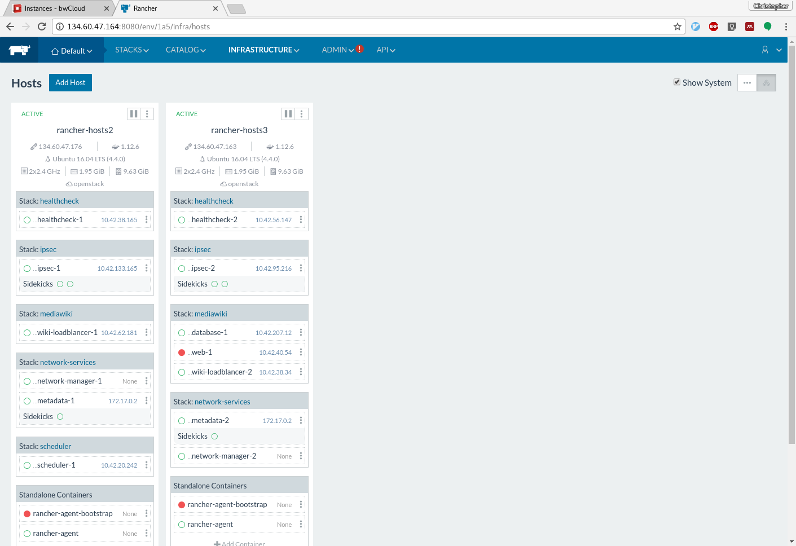
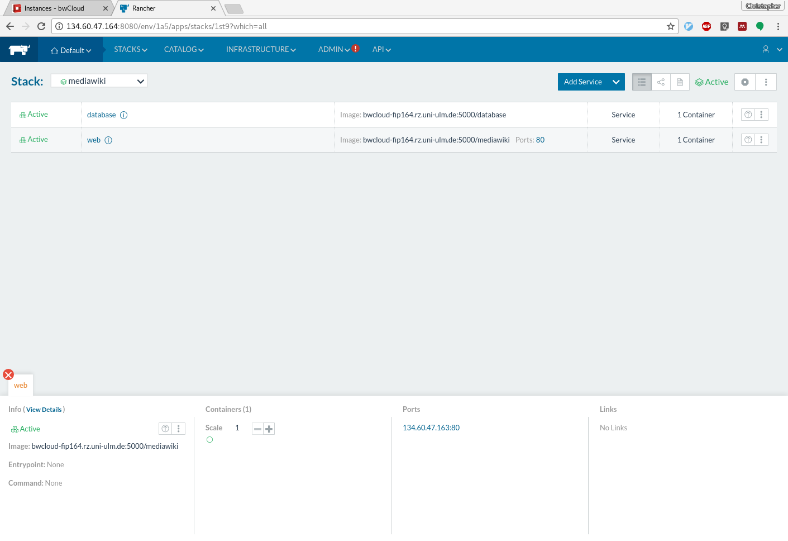
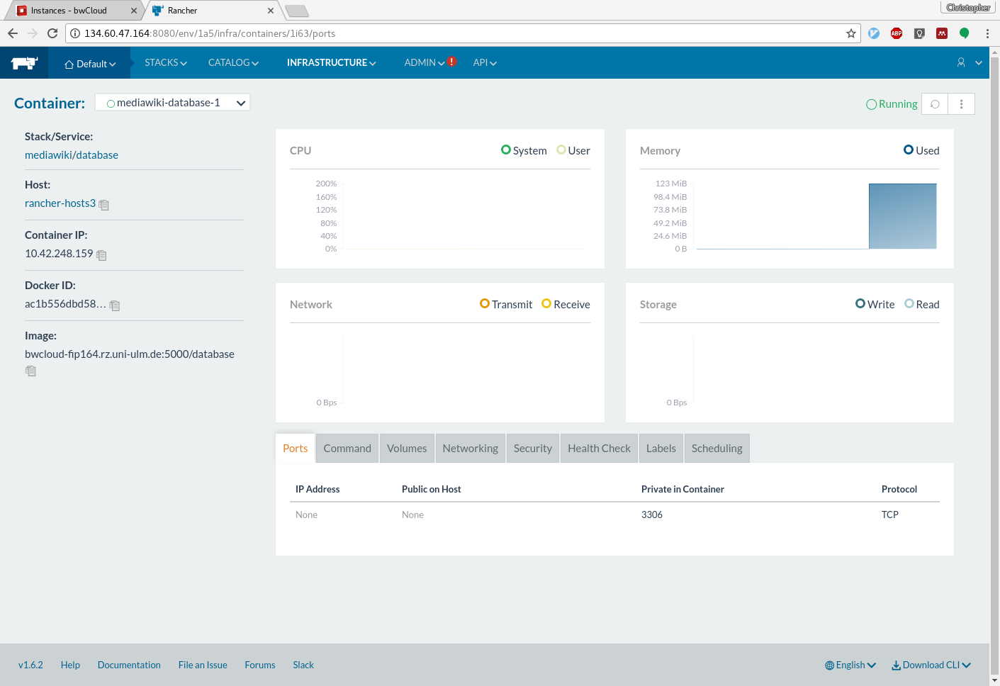

# Answers to questions

## Lesson 1: Container Orchestration with Docker Swarm

### Questions: Docker Swarm

*In the Swarm terminology, what are services, tasks, and containers?*

A service is a declarative description of a task, executed by a container. 
Several (replicated) tasks may serve as a service, while the task uses a container
to run software to fulfil it's purpose.

*Where in our Cloud Stack do you place Docker Swarm?*

The virtual machines have to be created externally. Docker engines have
to be assigned to a Swarm cluster. Swarm automates from Containers on upwards.

| Cloud Stack | Example | Deployment Tool | 
| --- | --- | --- |
| **Application Component** | Mediawiki | Dockerfile/Bash |
| **Containers** | Docker | Docker Swarm |
| **Virtual Resource** | Instance m1.small | Terraform |
| **Cloud Platform** | OpenStack | - |

## Lesson 2: Container Orchestration with Rancher

### Questions: Rancher

*Where in our Cloud Stack do you place Rancher?*

Rancher offers the full cloud stack: from allocating resources to container placement and triggers application deployment via Docker.

| Cloud Stack | Example | Deployment Tool | 
| --- | --- | --- |
| **Application Component** | Mediawiki | Dockerfile/Bash |
| **Containers** | Docker | Rancher |
| **Virtual Resource** | Instance m1.small | Rancher |
| **Cloud Platform** | OpenStack | - |

Yet, Rancher does not automate the resource allocation depending on demands (e.g. http requests per second, or cpu load). 
This feature has has to be added separately.

# Solution for practical part

## Docker Swarm

Docker Swarm works without additional software, since it is integrated in Docker.
Yet it does not automate the creation of nodes when all available nodes are fully packed with containers.
Scaling and updating containers works within seconds. 
Loadbalancing is partially replaced by Swarm's networking: services are accessible from any of the 
joined nodes.

## Rancher

Rancher starts virtual machines in bwcloud, and adds them as hosts to Rancher.

Rancher defines so called Stacks, which contain services. A service refers to
a docker image, which is used to deploy a container to serve the service.

Rancher provides monitoring, control, and overview of hosts and containers.

